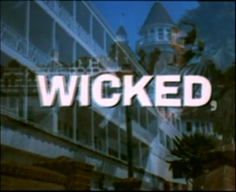

# Duo-Vision Recomposer

A command-line tool for artists, filmmakers, and archivists to re-imagine and re-compose films shot in the "Duo-Vision" split-screen format.



## Concept

In the chronicles of cinematic history, few innovations have promised the narrative potential of Duo-Vision. This format presents two distinct video streams simultaneously, side-by-side, unlocking new dimensions through juxtaposed-parallel actions, contrasting perspectives, or complementary imagery.

The Duo-Vision Recomposer is a tool designed to repurpose this powerful technique for new creative applications. It provides the essential function to split the two streams and masterfully recombine them using a variety of artistic blend modes. This project empowers modern filmmakers and archivists to explore a cinematic language that is both visionary and elegantly simple.

## Features

-   **Precise Extraction:** Isolate the left and right video streams from a source file.
-   **Pixel-Perfect Cropping:** Full control to define the exact dimensions of each stream, allowing you to remove any central artifacts or black bars.
-   **Creative Blending:** Combine the left and right views using various `ffmpeg` blend modes to create unique artistic effects.
-   **Audio Preservation:** Retains the original audio track in the final composed video.
-   **Automated Workflow:** A single command runs the entire extraction, blending, and audio-syncing process.
-   **Organized Output:** Creates a timestamped directory for each run, containing the split streams, the final video, and a summary log.
-   **Smart Defaults:** Automatically calculates the half-width for cropping if not specified.

## Requirements

- [ffmpeg](https://ffmpeg.org/): A complete, cross-platform solution to record, convert and stream audio and video.

## Usage

The repository contains a single tool: `process_video.sh`.

### Basic Usage
To generate a 30-second test clip from the beginning of a Duo-Vision film:
```bash
./process_video.sh "/path/to/your/duo-vision-film.mkv" --length 30
```

### Advanced Usage
To process a 20-second clip starting at the 40-second mark, with custom cropping to remove a central artifact, and higher contrast:
```bash
./process_video.sh "/path/to/your/duo-vision-film.mkv" \
    --start 40 \
    --length 20 \
    --left-crop "340:328:0:0" \
    --right-crop "340:328:400:0" \
    --contrast 1.5
```

For a full list of options, run the script with the `--help` flag.

To process the entire film, simply omit the `--start` and `--length` constraints.

## Coming Soon: New Ways to Play

**Forwards & Backwards**
A shining new tool will overlay a clip with its own reverse image, creating a haunting blend of temporal echoes and spectral premonitions.

**Anaglyph 3D**
Also planned is a 'Chaos Mix' mode for the entire Duo-Vision Suite, bringing a new, disorienting depth to all your creations.

## Support the Project

If you find this project useful and would like to show your appreciation, you can:

- [Buy Me a Coffee](https://buymeacoffee.com/pequet)
- [Sponsor on GitHub](https://github.com/sponsors/pequet)

Your support helps in maintaining and improving this project. 

## License

This project is licensed under the MIT License.